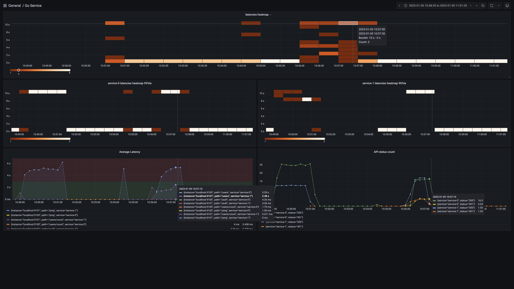
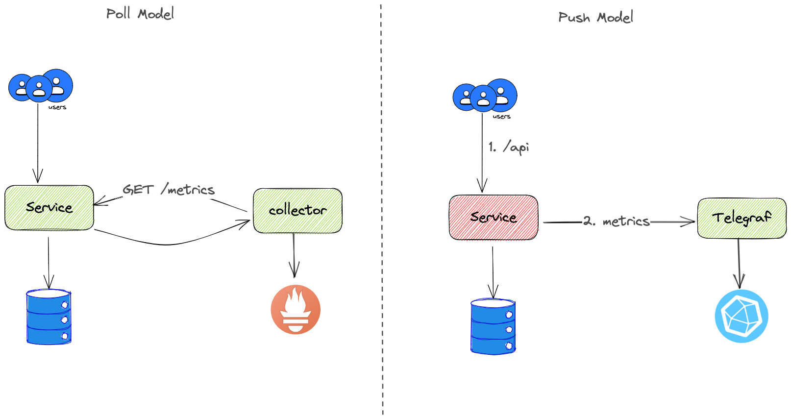

# Go metrics

library to capture go service metrics, abstracting protocol (http, gRPC) and details of timeseries db.

[](https://goreportcard.com/report/github.com/scalescape/go-metrics)

## Prometheus Setup

Expose prometheus `/metrics` endpoint in `9101` port

```go
obs, err := metrics.Setup(
	    metrics.WithAddress(":9101"),
        metrics.WithServiceName("service-name")
    )
m := mux.NewRouter()
m.Use(mux.MiddlewareFunc(obs.Middleware))

# add required handlers ... 
err = http.ListenAndServe(addr, m)
```

## Statsd / Influx Setup

Follow the instructions to send metrics to statsd server running at `8125` port, which is configured to publish to influxdb

```go
	obs, err := metrics.Setup(
		metrics.WithAddress("localhost:8125"),
		metrics.WithServiceName(appCfg.Metrics.ServiceID),
		metrics.WithKind(common.Statsd),
	)
```

## **Metrics**
`http_latency_ms`
- captures latency of each request in milliseconds with tags `service, method, path, status`
- In prometheus configured as [Histogram](https://prometheus.io/docs/concepts/metric_types/#histogram) and follow the [instructions](https://prometheus.io/docs/practices/histograms/) for more details on visulaization 

`http_requests`

captures request status and count with tags `service, method, path, status`
- In prometheus configured as [Gauge](https://prometheus.io/docs/concepts/metric_types/#gauge)

## Visualization

Once integrated you can configure grafana to read from prometheus/influxdb datasource and create a dashboard to monitor your service.


## Architecture 

In order to decide which means to use, you've to be aware of Pull vs Poll architecture and what fits your need based on ecosystem.




In k8s ecosystem prometheus is a standard and in vm ecosystem influx is used widely.


## TODO

We'll support prometheus, influxdb and add open-telemetry for db transactions

- [x] Prometheus
- [x] Pprof
- [x] Statsd
- [ ] Influx API
- [ ] open-telemetry
- [ ] gRPC interceptor
- [ ] sql spans tracing

